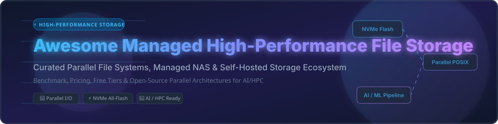

# Awesome-Managed-High-Performance-File-Storage ⚡

## 🚀 Top Managed High-Performance File Storage Ecosystem

  

**Curated List of SaaS Products & Open-Source Parallel File Systems for AI, HPC & Enterprise Analytics** 📊  
*Focused on Parallel File Systems, Managed NAS & Self-Hosted High-Performance Storage Architectures*  

📅 **Last updated: October 2026**

---

This repository tracks notable **commercial managed high-performance file storage platforms** and **open-source parallel storage projects** that deliver extreme IOPS, low sub-millisecond throughput, and high bandwidth for HPC, AI/ML model training, media rendering, and big data analytics — spanning from fully managed cloud NAS (AWS FSx, Azure NetApp Files, Google Cloud Filestore) to enterprise scale-out parallel file systems (WekaFS, VAST Data, Qumulo) and open-source engines (DAOS, Lustre, BeeGFS, Ceph, MinIO).

---

## 📑 Table of Contents

- [📊 Sector Overview & Market Dynamics](#-sector-overview--market-dynamics)
- [☁️ SaaS / Hosted Platforms](#%EF%B8%8F-saas--hosted-platforms)
- [💻 Open-Source GitHub Projects](#-open-source-github-projects)
- [🤝 How to Contribute](#-how-to-contribute)
- [💖 Support & Sponsorship](#-support--sponsorship)
- [⚠️ Disclaimer](#%EF%B8%8F-disclaimer)
- [📈 Star History](#-star-history)

---

## 📊 Sector Overview & Market Dynamics

> 💡 **Estimated Market Size & Sector Concentration**:  
> The next-generation high-performance enterprise data storage market is estimated at **$16.7 Billion USD in 2026** (growing at an estimated **8.3% CAGR**), while cloud-based parallel file storage is accelerating at over **19% CAGR** driven by massive Generative AI GPU cluster demands. The sector is **moderately fragmented**: hyper-scaler cloud providers (Amazon, Microsoft, Google) dominate cloud-native NAS offerings, while specialized all-flash parallel file system vendors (Pure Storage, WekaFS, VAST Data) and open-source HPC veterans (Lustre, DAOS) capture intense performance-critical workloads without a single "winner-take-all" monopoly.

---

## ☁️ SaaS / Hosted Platforms

*Sorted by Company Size / Market Valuation (Descending)*

| Product | Company Size / Revenue / Valuation | Description | Pricing | Free Tier / Free Trial Limit | Best For |
| :--- | :--- | :--- | :--- | :--- | :--- |
| **[Amazon FSx](https://aws.amazon.com/fsx/)** | **~$3.3 Trillion** Market Cap (AWS ~$105B+ Annual Revenue) | AWS family of managed file storage services (FSx for Lustre, NetApp ONTAP, OpenZFS, Windows File Server). | Starting at $0.005/GB-month for FSx for Lustre (Intelligent-Tiering); FSx for Windows Server from ~$0.013/GB-month (HDD). | No free tier or trial included (Pay-as-you-go). Standard AWS $200 promo credits apply to new AWS accounts. | AWS-native high-performance file storage |
| **[Azure NetApp Files](https://azure.microsoft.com/en-us/products/netapp-files/)** | **~$3.1 Trillion** Market Cap (Microsoft Azure ~$110B+ Annual Revenue) | Microsoft managed NetApp file storage for enterprise-grade NFS and SMB shares with extreme throughput. | Standard Tier starting at $0.14746/GiB-month (Cool Access storage at $0.05986/GiB-month). | $200 free credits valid for 30 days via Azure Free Account (no product-specific perpetual free tier). | Azure-native workloads |
| **[Google Cloud Filestore High Scale](https://cloud.google.com/filestore)** | **~$2.2 Trillion** Market Cap (Google Cloud ~$40B+ Annual Revenue) | Google managed NFS file storage for HPC, AI, and analytics workloads. | Basic HDD starting at $0.16/GiB-month (minimum provisioned capacity floor of 1 TiB). | $300 free trial credits valid for 90 days via Google Cloud Free Program (no perpetual free tier). | GCP-native workloads |
| **[IBM Spectrum Scale](https://www.ibm.com/products/storage-scale)** | **~$200 Billion** Market Cap (IBM ~$62B Annual Revenue) | Enterprise parallel file system (GPFS) with Transparent Cloud Tiering to object storage. | Software capacity licensing starting at ~$0.06/GB-month (capacity-based per TiB/year). | Developer Edition free forever (limited to 12 TB total capacity per cluster for testing/eval). | Large-scale enterprise HPC |
| **[NetApp Cloud Volumes ONTAP](https://www.netapp.com/ontap-cloud/)** | **~$25 Billion** Market Cap (~$6.2B Annual Revenue) | Managed enterprise file storage on AWS, Azure, and GCP supporting NFS, SMB, and iSCSI. | Starting at $0.036/GiB per month for Pay-As-You-Go; capacity pool licensing available. | 30-day free trial (up to 500 GiB capacity, cloud infrastructure costs apply separately). | NetApp ecosystem users |
| **[Pure Storage FlashBlade](https://www.purestorage.com/products/unified-file-and-object-storage.html)** | **~$20 Billion** Market Cap (~$3.1B Annual Revenue) | Unified fast file and object storage platform scaling from 119TB to 7.8PB in a single namespace. | Evergreen//One consumption subscription starting at ~$0.09/GB-month (3-year term commitment). | Test Drive / Proof-of-Concept (POC) available upon request (no self-serve free trial). | Modern unstructured data workloads |
| **[VAST Data Universal Storage](https://www.vastdata.com/)** | **~$9.1 Billion** Valuation (~$200M+ ARR) | Disaggregated, Shared-Everything (DASE) architecture delivering unified file, object, and DB storage. | Gemini subscription software licensing starting at ~$0.08/GB-month usable capacity (36-60 month term). | Proof-of-Concept (POC) deployment upon sales approval (no self-serve free trial). | AI and data-intensive applications |
| **[WekaFS Cloud](https://www.weka.io/)** | **~$1.6 Billion** Valuation (~$100M+ ARR) | High-performance parallel file system designed for NVMe flash and AI/ML workloads. | AWS Marketplace Pay-As-You-Go: $0.036/GB-month for storage + compute charges for backend instances. | 14-day free trial on AWS/GCP Marketplace (or contact sales for POC sandbox environment). | AI/ML and HPC workloads requiring extreme performance |
| **[Qumulo](https://qumulo.com/)** | **~$1.2 Billion** Valuation (~$80M+ ARR) | Scale-out file storage with high-performance data services (NFS, SMB, S3). | Pay-As-You-Go cloud consumption starting at ~$37.00/TB-month on Azure/AWS. | 7-day free trial for Azure Native Qumulo (ANQ); up to 30-day trial for general cloud deployments. | Media and life sciences workloads |
| **[Panasas ActiveStor](https://www.panasas.com/)** | **~$150 Million** Estimated Valuation (~$50M ARR, now VDURA) | HPC parallel file system running PanFS (now VDURA Data Platform) with self-healing architecture. | VDURA Software Subscription model starting at ~$0.05/GB-month software license (plus hardware costs). | Interactive Demo / Managed POC sandbox upon request (no public free trial). | HPC and AI/ML environments |

---

## 💻 Open-Source GitHub Projects

*Sorted by GitHub Stars_Count (Descending)*

| Project | GitHub_Stars | License | Highlights & Architecture | Best For |
| :--- | :--- | :--- | :--- | :--- |
| **[Ceph](https://github.com/ceph/ceph)** |  | LGPL-2.1 | Unified distributed storage system supplying object, block, and POSIX CephFS file system scaling to exabytes. | Unified enterprise storage infrastructure |
| **[MinIO](https://github.com/minio/minio)** |  | AGPL-3.0 | De facto standard for high-performance S3-compatible object storage with erasure coding and bitrot healing. | High-performance object storage |
| **[SeaweedFS](https://github.com/seaweedfs/seaweedfs)** |  | Apache-2.0 | Fast distributed storage handling billions of small/large files with low latency and S3/POSIX support. | Scale-out file and object workloads |
| **[OpenZFS](https://github.com/openzfs/zfs)** |  | CDDL-1.0 | Foundational open-source file system and volume manager with copy-on-write integrity and RAID-Z. | Local enterprise storage nodes |
| **[JuiceFS](https://github.com/juicedata/juicefs)** |  | Apache-2.0 | High-performance POSIX file system built on top of Redis/SQL and Object Storage, optimized for cloud-native AI. | Cloud-native HPC & AI data pipelines |
| **[TrueNAS SCALE](https://github.com/truenas/scale)** |  | BSD-3-Clause | Linux-based hyperconverged storage OS combining ZFS, container orchestration, and web management. | Self-hosted scale-out NAS |
| **[GlusterFS](https://github.com/gluster/glusterfs)** |  | GPL-2.0 / LGPL-3.0 | Distributed scale-out file system with elastic volume management and no metadata server bottlenecks. | Distributed scale-out file storage |
| **[Lustre](https://github.com/lustre/lustre)** |  | GPL-2.0 | Veteran open-source parallel file system powering the world's fastest Top500 supercomputers. | Large-scale HPC supercomputing |
| **[Garage](https://git.deuxfleurs.fr/Deuxfleurs/garage)** |  | AGPL-3.0 | Lightweight geo-distributed S3-compatible object storage designed to run on self-hosted heterogeneous nodes. | Geo-distributed light object storage |
| **[DAOS](https://github.com/daos-stack/daos)** |  | BSD-2-Clause-Patent | Record-breaking parallel file system built from scratch for SCM/NVMe SSDs with IO500 benchmark leadership. | Extreme NVMe parallel HPC & AI |
| **[Curve](https://github.com/opencurve/curve)** |  | Apache-2.0 | High-performance distributed file system and block storage system developed by NetEase. | Cloud-native block & file storage |
| **[MooseFS](https://github.com/moosefs/moosefs)** |  | GPL-2.0 | Fault-tolerant distributed POSIX file system creating a single namespace across multiple servers. | Distributed fault-tolerant storage |
| **[BeeGFS](https://github.com/beegfs/beegfs-core)** |  | GPL-2.0 | High-performance parallel file system designed for performance-critical HPC and AI workloads. | HPC and AI compute clusters |
| **[LizardFS](https://github.com/lizardfs/lizardfs)** |  | GPL-3.0 | Open-source software-defined distributed file system supporting erasure coding and geo-replication. | Distributed scale-out storage |
| **[Expand](https://github.com/expand-project/expand)** |  | Open-Source | Ad-hoc parallel file system optimizing data locality across MPI, TCP, and Big Data Spark setups. | HPC ad-hoc parallel tasks |
| **[Warehouse](https://github.com/ultravioletasdf/warehouse)** |  | Open-Source | Lightweight distributed object storage engineered for small files with ultra-low 17-byte metadata overhead. | Small-file heavy storage |
| **[Quobyte](https://github.com/quobyte/quobyte)** |  | Commercial / OS parts | High-performance scale-out parallel file system for AI, HPC, and Kubernetes data platforms. | Kubernetes & AI storage |
| **[VDURA PanFS](https://github.com/vdura/panfs)** |  | Commercial / OS parts | Software-defined parallel file system (Panasas PanFS) optimized for AI and HPC workloads. | Enterprise HPC clusters |

---

## 🤝 How to Contribute

We welcome contributions from storage engineers, HPC architects, and open-source maintainers!

1. Fork this repository.
2. Edit `README.md` following the established table structure.
3. Ensure all links point to official documentation/repositories and retain valid metrics.
4. Open a Pull Request with a clear description of your additions or updates.

---

## 💖 Support & Sponsorship

Thank you for exploring and utilizing this curated directory of high-performance storage solutions! If this resource saved you time or guided your infrastructure architecture, please consider:

- 🌟 **Starring** this repository to increase visibility.
- 🔀 **Forking** and contributing new storage tools or benchmarks.
- 📢 **Sharing** this repository with your network, DevOps teams, or HPC colleagues.
- ☕ **Sponsoring**: If you'd like to support ongoing updates and open-source maintenance, buy me a coffee via the [GitHub Sponsor Dashboard](https://github.com/sponsors/ishandutta2007).

---

## ⚠️ Disclaimer

- This list is **community-curated** for educational and architectural reference — it does not constitute an endorsement.
- **Performance benchmarks vary by workload**: Enterprise requirements differ between small random I/O and large sequential read/write pipelines.
- Always review vendor licensing (AGPL, GPL, LGPL, CDDL, BSD) prior to production deployment.

---

## 📈 Star History

---

**Made with ❤️ for storage engineers, HPC architects, and infrastructure teams.**
